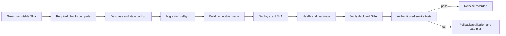

# Deployment Workflow Requirements

## PR #8 decision

Recommendation: **REJECT** PR #8 (`claude/vps-deploy-main`, head `62afde8`) as superseded and unsafe.

Its standalone workflow deploys on every `main` push without depending on the repository's Production Readiness jobs. GitHub may run independent workflows concurrently, so the SSH deployment can begin before tests, Docker build, E2E smoke, or the deploy gate finish. It also:

- deploys a moving `origin/main` branch rather than the immutable event SHA;
- trusts a host discovered at deploy time with `ssh-keyscan`/`accept-new`;
- runs migrations as part of `docker compose up` without a recorded preflight or database backup;
- verifies only `/api/health`, not readiness or the deployed commit;
- has no automatic revision rollback or post-deploy smoke suite.

Current `origin/main` already has a materially safer single-workflow chain in `.github/workflows/ci.yml`: `verify`, `docker`, and `smoke` feed `deploy-gate`, which gates `deploy-production`. It pins `github.sha`, uses preconfigured known hosts, backs up PostgreSQL/Redis/agents, runs migrations explicitly, checks health and readiness, verifies the deployed SHA, and restores the previous application revision on failure. Future work should improve that existing path rather than merge PR #8.

## Required release flow

1. **Green immutable SHA.** The deployment input is the exact commit that completed all required checks. Never resolve a moving branch on the VPS.
2. **Required checks completed.** TypeScript, lint, unit/integration tests, PostgreSQL migrations, Docker build, E2E, security checks and the explicit deploy gate must be successful for that SHA.
3. **Database backup.** Create timestamped, release-associated PostgreSQL and Redis backups and verify that backup creation succeeded before schema mutation. Record the previous application SHA.
4. **Migration preflight.** Run `prisma validate`, `migrate status`, destructive-SQL review, disk-capacity checks and any release-specific integrity probe against a production-shaped database before deployment.
5. **Image build.** Build once from the immutable SHA, identify the image by digest/SHA, and deploy that artifact. A production host should not create an untracked build from a moving checkout.
6. **Deployment.** Use a protected GitHub Environment, least-privilege SSH identity, pinned host keys, non-overlapping concurrency and an explicit maintenance/compatibility strategy for migrations.
7. **Health check.** Confirm the process/container is alive.
8. **Readiness check.** Confirm database, Redis, migrations and required dependencies are ready to serve traffic.
9. **Deployed-SHA verification.** Compare the running release identifier with the green release SHA; container health alone is insufficient.
10. **Smoke test.** Exercise an authenticated, tenant-scoped read and a safe write/rollback path. Include the Learning Core scheduler/worker status when that feature is enabled.
11. **Rollback.** On failure, restore the previous immutable application artifact. For forward-only migrations, use a rehearsed compatibility/restore plan; never imply that checking out old code automatically reverses data changes.

## Remaining improvements to current main

- Build and deploy a registry-published image digest rather than rebuilding on the VPS.
- Add an authenticated post-deploy application smoke test, not only health/readiness.
- Verify backup restore procedures on a schedule; successful `pg_dump` is not proof of recoverability.
- Surface migration/preflight and deployed SHA in release metadata and operator alerts.
- Treat irreversible database migrations as a separate go/no-go approval with a documented restore point.
