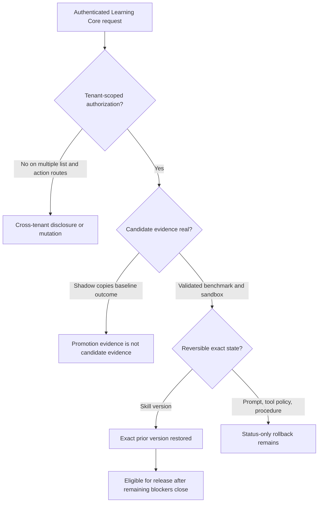

# Learning Core Release Audit

## Release decision

**DO NOT MERGE PR #20 into `main` yet.** The branch contains substantial real implementation and its database migrations apply cleanly, but the current HTTP surface is not tenant-safe and its “shadow” evidence does not execute or evaluate the candidate behavior. Those are release blockers, not documentation nits.

## Exact state and scope

- Audit branch: `codex/learning-core-release-audit`
- Audit implementation snapshot before documentation: `643f0908d6b40b696fe302711aa221a1163e1972`
- Reviewed PR #20 head: `c5d9509aad817c8e02f0a7ed1f8ce7887cd2a1b1`
- Initial reviewed head before Claude's final two commits: `5d5eeea65ef5f4be50b8bb967dd06dfa81aa8398`
- `origin/main`: `8197cd4a8b08088e02644d03e7ceba6baca24345`
- Merge base: `8197cd4a8b08088e02644d03e7ceba6baca24345`
- Final reviewed PR delta: 99 files, 10,400 insertions, 116 deletions across 11 commits.
- Migrations reviewed:
  - `20260802002232_learning_core_on_neural_engine`
  - `20260802024239_rollback_skill_version_links`
- In scope: all 11 PR commits; schema/migrations; every `/api/learning/*` route; Neural Engine candidate review/apply/rollback; policy, sandbox, shadow, benchmark, feature-flag, queue/worker, Learning Core UI; PR #17 unique-value review; PR #8 deployment review.
- Excluded: production data, third-party model correctness, destructive sandbox payloads, and deployment to the real VPS. No claim is made that unexecuted external integrations work.

The audit ran in `/home/rusty/Development/Sentinel-release-audit`. Claude's live checkout and branch were not modified. Claude's two later commits were merged without rewriting their history; two comment-only conflicts in queue/worker files were resolved by retaining both their live-verification record and the audit's retry/shutdown hardening.

## Severity findings

### Critical

1. **Authenticated cross-tenant reads remain widespread.** Authentication is present, but many routes read global tables without workspace/project/user predicates: overview, candidates, curiosity, reflections, goals, knowledge gaps, replay, benchmark definitions, feature flags, skills/versions, scheduler status, improvement queue and timeline. An authenticated user can enumerate other tenants' Learning Events, candidates, reflections, approvals, flags, benchmark definitions and operational history. Several underlying models (`Skill`, `TrustEvent`, `AgentCompetency`, replay runs) lack direct tenant ownership, so safe remediation needs a deliberate read-model/schema design rather than a cosmetic `requireUser()` check.
2. **Shadow mode does not run the candidate.** `runShadowSample()` marks success from the historical Experience's baseline status. For code-bearing candidates it validates the hard-coded command `true`, not the proposed implementation. Five historically successful fixtures can therefore produce promotion confidence even if the candidate would regress. Duplicate fixture inflation is fixed, but the semantic evidence remains invalid.

### High

1. Candidate review originally allowed any existing user to approve another workspace's candidate. Protected candidates with no resolvable workspace fell back to status-only approval. Both bypasses were proven and fixed on this audit branch.
2. Directly setting `LearningCandidate.status="approved"` plus any real `reviewedBy` user originally passed apply-time authorization. Apply now requires a matching human-review AuditLog and, when linked, a matching approved ApprovalRequest.
3. Benchmark-result POST originally allowed arbitrary authenticated metric injection for another tenant, accepted values such as `accuracy=1.5` and `safetyViolations=-10`, and promotion accepted incomplete hard-guardrail evidence. These are fixed and regression-tested.
4. Canonical candidate mutations occur before the final candidate/audit transaction in `applyLearningCandidate()`. A later database or audit failure can leave the target mutated while the candidate/audit state is incomplete.
5. Automatic rollback was status-only for every SkillVersion. Exact restoration of the prior immutable skill version is fixed. Procedure, contradiction, prompt-change and tool-policy-change inverse mutations remain undefined/status-only, so “automatic rollback” is not generally true.
6. The first migration begins with `DROP INDEX "knowledge_objects_sourceType_sourceId_idx"`. This index removal is unrelated to Learning Core and appears to reconcile prior drift because the current main schema no longer declares it. It removes a useful source lookup index and should be separated, justified with query evidence, or restored before release.
7. Newly added improvement-queue and timeline APIs are global cross-tenant reads. Their UIs swallow request failures and show an honest-looking empty state.

### Medium

1. FeatureFlag has no activation/expiry fields, so future activation and expiry behavior required by the rollout specification cannot be implemented or tested. Database constraints also do not enforce rollout percentage or risk-tier values.
2. Global/organization feature-flag mutation now fails closed because Sentinel has no system/organization admin authority in this path. The UI still defaults creation to `global`, so the default form submission fails.
3. “Experiments” renders Experience Replay. The comment explains the compromise, but the production label remains materially misleading.
4. Learning Settings is still a production tab backed by `NotYetBuiltView`. This is honest, but it means the advertised module is incomplete.
5. Several views (`Curiosity`, `Reflections`, `Benchmarks`, `Replay`, `Shadow Runs`, `Improvement Queue`, `Evolution`) swallow fetch/mutation failures and render empty state or continue as if the action completed.
6. Queue retries/backoff were absent from persisted job options, the dead-letter threshold could never be reached, worker concurrency was not bounded against invalid/extreme environment values, and shutdown left Queue connections open. These are fixed. The added deadline rejects worker processing but cannot cancel arbitrary database work already running; handlers need cancellation-aware design for a hard timeout.
7. Only degradation sweeps write `ScheduledJobRun`. Knowledge-gap and replay jobs have BullMQ state but no durable database run ledger, so the scheduler-status UI is not a complete job history.
8. Redis is configured `noeviction` with a 256 MB ceiling. Under queue growth Redis will reject writes, which is safer than evicting queue data but is an availability risk requiring alerting, retention and capacity planning.
9. Shadow uniqueness is service-enforced with an advisory lock, not a database unique constraint. Out-of-band/manual rows can still be inserted; evaluation now de-duplicates them defensively.

### Low

1. Several numeric `limit` query parameters accept `NaN`, negative or fractional values rather than a common validated pagination contract.
2. Sandbox command filtering is regex-based defense in depth. The Docker boundary is the real isolation mechanism; image provenance and digest pinning are not enforced by this module.
3. Some comments still describe the Docker sandbox as unverified even though this audit exercised it live. Comments should name the verified image/commands and retain the distinction between a smoke test and a security certification.

## Proven fixes on the audit branch

- Added tenant/resource authorization helpers that fail with a non-enumerating 404.
- Enforced authorization for benchmark results/creation, trust reads, reflection mutation, feature-flag mutation, shadow access and Neural rollback.
- Made protected candidate review fail closed without a workspace and required `approval.review` in the resolved workspace.
- Required apply-time audit/ApprovalRequest evidence for human-approved candidates.
- Validated benchmark bounds and required baseline/candidate accuracy, hallucination, cost and latency evidence.
- De-duplicated shadow fixtures under a PostgreSQL advisory lock and de-duplicated historical rows during evaluation.
- Hardened sandbox execution: secret/traversal paths, credential-shaped environment variables, output bound, `--cap-drop ALL`, execution-time revalidation and non-zero exit handling.
- Restored the exact prior SkillVersion and Skill convenience fields transactionally on rollback.
- Persisted three attempts plus exponential backoff for every recurring BullMQ job; bounded concurrency; added a worker deadline; closed Queue connections on shutdown.

## Regression coverage added

| Test file | Proof |
|---|---|
| `tests/release-audit/governance-regressions.test.ts` | Unscoped Tier-3 fail-closed, cross-workspace reviewer rejection, direct-status tamper rejection, shadow dedupe, incomplete benchmark guardrails, invalid metric rejection. |
| `tests/release-audit/learning-api-authorization.test.ts` | Outsider cannot mutate another workspace flag/reflection, read agent trust, inject benchmark results, run shadow work, or roll back a candidate. |
| `tests/release-audit/sandbox-security.test.ts` | Traversal/secret path rejection, credential env rejection, execution-time revalidation, 64 KiB output bound and non-zero exit failure. |
| `tests/release-audit/rollback-restoration.test.ts` | Exact previous SkillVersion and parent Skill state are restored without deleting history. |
| `tests/release-audit/queue-regressions.test.ts` | Real Redis scheduler templates persist bounded attempts and exponential backoff. |

## Commit-by-commit review

Every commit below was inspected with both `git show --stat` and `git show`.

| SHA | Purpose / runtime and schema impact | Security and tests | Claims verified / defects / risk |
|---|---|---|---|
| `b4585c6` | Phase A event/redaction foundation, UI shell and 451-line migration; extends Experience/LearningCandidate/Skill and adds Learning Core tables. | Adds redaction and audit integration; expands chat capture. | Neural Engine is extended rather than replaced. Migration contains unrelated index drop; overview is global. **High**. |
| `2d6d4fb` | Curiosity/reflection, scheduler endpoint, approval linkage and review/rollback changes. | Adds degradation/learning-loop tests. | Scheduler records runs and bearer auth is real. Review authorization and no-workspace fallback were unsafe. **Critical** before audit fixes. |
| `f9d6c58` | Preferences and Knowledge Gaps with UI/API and integration tests. | Evidence weighting/conflict representation and advisory-lock dedupe are real. | Preference API is user-bound; knowledge-gap APIs are not tenant-safe. **High**. |
| `f8df965` | Wires curiosity and intent capture into live chat. | Adds redaction/event capture but substantially changes the shared chat route. | Integration is real; no duplicate core model introduced. Chat behavior was inspected but not live-model tested. **Medium**. |
| `9a8a3de` | Goals and candidate generation from gaps. | No dedicated authorization tests. | Generation uses LearningCandidate, but list/create/update APIs are global and accept inaccessible goals/gaps. **Critical**. |
| `281af96` | Benchmarks, Docker/test sandbox, trust and feature flags plus UI/tests. | Adds deterministic flag tests and sandbox unit tests. | Core code is real, but metric injection/bounds, tenant checks and sandbox boundary gaps were missed. **Critical** before fixes; high residual. |
| `d6a00d6` | Shadow runs, automatic rollback, feature-flag linkage and SkillVersion migration/UI. | Adds rollback/version tests. | Rollback side effects/audit/trust/event sequence is real. Existing test did not prove exact skill restoration; shadow evaluates baseline, not candidate. **Critical**. |
| `bee22ee` | Replay, BullMQ/Redis worker, skill generation and centralized risk transition gates. | Adds skill/risk tests and queue infrastructure. | Queue/worker are real. Retry/backoff were not persisted; timeout/connection shutdown missing. Skill pipeline uses sandbox/benchmark/shadow, but shadow proof is semantically invalid. **High**. |
| `5d5eeea` | Validates reflection evidence scope for generated skills. | Adds foreign/fabricated evidence tests. | Scope validation is a real improvement and tests exercise it. **Low** residual. |
| `c558dcc` | Adds Improvement Queue and Evolution Timeline views/routes. | No tenant or error-state tests. | Data is real, not fabricated, but both APIs expose global data and both UIs swallow errors. **Critical**. |
| `c5d9509` | Direct `tsx` worker command and live-verification comments. | Reports live Redis success/retry/DLQ/dedupe/shutdown. | Direct command fixes signal propagation. Audit independently reproduced job success and retry/DLQ; audit additionally fixed job options and Queue closure. **Medium** before fixes. |

## Architecture integrity

The duplicate-model searches did not find `Hypothesis`, `AgentTrustProfile`, `ImprovementProposal`, `LearningMemory`, `NewAgent` or `SkillDefinition`. `ExperimentRun` is evidence attached to canonical `LearningCandidate`, not a competing candidate authority. Canonical Experience, Outcome, Evaluation, LearningCandidate, AgentCompetency, Skill, ApprovalRequest, AuditLog, Memory, KnowledgeObject and KnowledgeEdge remain in use.

The main architectural inconsistency is the HTTP/read-model layer: canonical rows frequently have nullable or absent tenant ownership, and routes return them globally. This must be resolved without adding a second learning system.

## Risk-policy result

The central `classifyRiskLevel()`/`assertRiskTransitionAuthorized()` path correctly keeps trust out of Tier-3 authorization, rejects wildcard skill permissions, recalculates protected candidate types at apply time, and rechecks feature-flag rollout expansion. Audit fixes close direct-status and reviewer/workspace bypasses.

Residual policy gaps:

- generic ApprovalRequest decisions and LearningCandidate review still update related state through separate service code rather than one shared transactional decision primitive;
- canonical mutation and candidate/audit persistence are not one transaction;
- flags can change configuration after review with only the current authenticated human check, not a review-specific approval artifact;
- tenant-less skills cannot support safe cross-tenant activation/listing.

## Sandbox result

Classification: **real Docker isolation adapter plus explicit test adapter and fail-closed unavailable adapter**. It is not an in-process “secure sandbox.” A live `alpine:latest` run completed `echo`, rejected a `/run/secrets` command before spawn, and failed a root filesystem write because the container was read-only. Unit/adversarial tests cover timeout behavior, command injection patterns, secret env stripping, output bounding, direct-execute validation and exit codes.

Residual limitations: the image is configured by mutable name rather than required digest; regex filtering is not a language parser; direct Docker CLI timeout can require `destroy()` cleanup; and this smoke test is not a container-escape certification.

## Redis/BullMQ result

Redis 7 database 15 was empty before the test and used as an isolated queue namespace with a real audit-branch worker.

- Safe job ID: `audit-isolated-safe-1785649901258`
- Enqueued: `1785649901258`; started: `1785649901276`; finished: `1785649901427`
- State: `completed`
- Durable run ID: `cmsbduhwy0000kq23smi56yns`, status `completed`
- Sweep result: 10 checked, 0 rolled back, 9 skipped for insufficient evidence
- Retry job ID: `audit-isolated-retry-1785649901258`
- State: `failed` after exactly 3 attempts; copied to dead-letter job `1`
- Backoff persisted in the scheduler template; repeated scheduler registration remained idempotent.
- Worker logged the successful job and all three failed attempts, then received SIGINT and logged graceful Queue/Worker closure. Test jobs, the DLQ copy, durable audit run and isolated Redis database were removed after evidence capture.

## Migration result

PostgreSQL 16 with pgvector was validated two ways:

1. fresh empty database: all 10 repository migrations deployed;
2. current-main-shaped database: the 8 main migrations were applied first, followed by the two PR #20 migrations.

Both passed Prisma validation/deploy and integrity checks for Learning Core tables, `LearningCandidate.approvalRequestId`, `SkillVersion.retiredAt`, and the FeatureFlag-to-candidate foreign key. Foreign-key delete behavior matches the schema (`SET NULL` for provenance links, `CASCADE` for owned benchmark/shadow/version rows). No nullable compound unique was introduced for KnowledgeGap; service-level advisory locking handles nullable scope dedupe.

Release caveat: successful migration execution does not justify the unrelated knowledge-object index removal.

## UI honesty result

No `Math.random()` metrics or demo records were found in Learning Core views. Most tabs call real APIs and several show useful loading/error/empty states. Release remains blocked because global APIs make those real views unsafe, several views collapse API failure into “empty,” Experiments is Replay under a misleading label, and Settings is still a production placeholder.

## Commands and evidence

Commands executed during the audit include:

- exact Git state/log/diff commands from the task;
- `git show --stat` and `git show` for every PR commit;
- architecture/duplicate-concept and UI-honesty `rg` searches;
- clean `npm ci` and Prisma generation;
- Prisma validation/migration deployment on fresh and main-shaped databases;
- the regression suites above, including their pre-fix failures;
- live Redis scheduler/worker success plus 3-attempt DLQ behavior;
- live DockerSandbox benign, secret-path and read-only-filesystem probes;
- `scripts/audit/verify-learning-core-migrations.sh` against both audit databases.

Final validation on the merged audit branch:

- `npm ci`: passed from a clean worktree-local install.
- `prisma validate` and `prisma generate`: passed.
- `npm run typecheck`: passed with zero errors.
- `npm run lint`: passed with zero errors/warnings.
- `npm test`: 83/83 suites and 190/190 tests passed, with no skipped or failed tests.
- `npm run build`: Next.js 16.2.9 production build passed.
- `npm run test:e2e`: the WSL host invocation could not launch Chromium because `libnspr4.so`, `libnss3.so`, `libnssutil3.so` and `libasound.so.2` are unavailable and sudo is not available. The same repository command was rerun in the version-matched `mcr.microsoft.com/playwright:v1.61.1-noble` image against this audit checkout: 4/4 passed in 17.0 seconds.
- Learning UI browser smoke: a disposable authenticated user exercised Curiosity, Improvement Queue, Evolution Timeline and Settings at 1440x960 and 390x844. Every route rendered its expected heading, no page errors/client exception appeared, and document width matched viewport width at both sizes. The five disposable users created during auth troubleshooting were deleted.
- `docker compose config --quiet`: passed.
- Python voice gateway: 2/2 tests passed in an isolated Python 3.12 container.
- `git diff --check`: passed.

## Unresolved release blockers

1. Define and enforce tenant ownership/filtering for every Learning Core list/read/action route, including the two latest UI routes.
2. Replace baseline-status shadow scoring with actual candidate execution/evaluation on equivalent sanitized fixtures; promotion must consume that evidence.
3. Make canonical candidate mutation plus candidate/audit persistence atomic or introduce a recoverable outbox/saga.
4. Implement exact rollback for every deployable candidate type or stop advertising those types as automatically reversible.
5. Remove, restore, or separately justify the unrelated knowledge-object index drop.
6. Remove/rename incomplete or misleading production tabs and make API failures visible.
