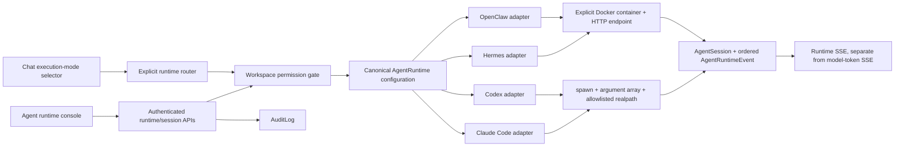

# Runtime Adapter Layer

## Verdict

**Implemented and CI-testable; not production-verified.** This development environment cannot reach `srv1427612.hstgr.cloud`, and the loopback Hermes/OpenClaw services only exist on that host. Every runtime therefore remains `Partial` or `Unavailable` until a human runs `scripts/vps-acceptance-test.sh` on the VPS and reviews its evidence.

## Architecture

`Agent` remains logical identity. `AgentRuntime` records execution configuration; `AgentSession` records durable session ownership/state; `AgentRuntimeEvent` is an ordered transcript/activity stream. The static registry remains only as compatibility data during migration.

## Implemented

- One `AgentRuntimeAdapter` contract and shared supporting types for Hermes, OpenClaw, Claude Code, and Codex.
- Additive runtime/session/event migration with five compatibility seeds and eight permission definitions per existing workspace.
- Explicit container names; agent ID is no longer assumed to equal a Docker container.
- Claude/Codex discovery, version/auth readiness, session persistence, streaming, cancellation, timeout, exit codes, logs, and truthful capabilities.
- Realpath containment prevents traversal and symlink escape. Processes use `spawn`/`execFile`, `shell: false`, argument arrays, a minimal environment, and no browser-supplied executable or flags.
- Codex defaults to `workspace-write` with `on-request` approval. Claude defaults to `acceptEdits`; neither exposes a route for arbitrary root execution or browser-provided environment variables.
- Workspace permissions for view, execute, cancel, restart, configure, elevate, logs, and tool approval. `elevate` is a permission to enter a future approval flow, not direct privilege escalation.
- Authenticated runtime/session APIs, direct task SSE, persisted event SSE, explicit chat execution modes, and no silent runtime-to-model fallback.
- Runtime console with distinct installation/process/API/auth/readiness states, repository selection from server-enumerated allowlisted roots, sessions, real events, cancellation, logs, capabilities, and native UI fallbacks.
- `/api/version` with build-time commit/timestamp/environment. Docker Compose and CI pass immutable build arguments.

## Deliberately partial or unsupported

- Hermes/OpenClaw task APIs are not assumed. Their adapters preserve health, Docker logs, restart/reload and native dashboards, but session/send/resume/cancel fail with `runtime_does_not_expose_capability` until the real host API contract is verified.
- Codex resume is reported unsupported. It is not emulated.
- Runtime events are durable in PostgreSQL, but active child-process cancellation is process-local. Multi-replica deployment needs sticky ownership or a worker/queue boundary.
- The current process adapters execute inside the Sentinel app process. The checked-in runner image does not install or mount the host's `~/.local/bin/claude` or `codex`; therefore production coding execution remains unavailable until deployment provides those binaries, provider auth, and an allowlisted project mount inside a constrained app/worker boundary. Host-only CLI discovery is not enough, and the acceptance script checks both boundaries.
- Docker log/restart/reload operations likewise require Docker control in the adapter execution boundary. The checked-in app image intentionally does not mount the root-equivalent Docker socket or install the Docker CLI, so those controls remain unavailable in the default container deployment. Prefer a narrow authenticated host control service over exposing the full socket to the browser-facing app.
- A host service bound strictly to `127.0.0.1` is not automatically reachable through `host.docker.internal`; the VPS must expose a narrowly scoped bridge/reverse-proxy path or run the adapter at the host boundary. The runbook requires API checks from Sentinel itself, not only host-side `curl` success.
- `initialPrompt` is retained in the public start contract, but the API expects task submission through the streaming message endpoint so execution output is not detached from a response consumer.
- The compatibility fallback supports read availability during an incremental migration; session mutations require migrated database rows and fail closed otherwise.
- Control status is never `Verified` in code. Verification requires host evidence for health, execution, streaming, cancellation, logs, restart where supported, authorization, and AuditLog writes.

## Unverified CLI assumptions

Claude Code is built against these documented assumptions:

- `claude --version`
- `claude auth status`
- `-p <prompt> --output-format stream-json --verbose`
- `--resume <externalSessionId>`
- `--permission-mode acceptEdits`

Codex is built against:

- `codex --version`
- `codex login status`
- `codex exec --json`
- `--sandbox workspace-write --ask-for-approval on-request`
- no supported resume capability in this adapter

Argument ordering, JSON event variants, authentication commands, binary ownership, dedicated execution user, and installed versions must be reconciled against the real VPS. No development CLI result is evidence about the VPS installation.

## Permission model

Workspace owners pass existing workspace authorization. Other users need the exact permission key through `Role`/`RoleAssignment`; an execute-only operator cannot restart, configure, elevate, or view logs unless separately granted. Session mutations additionally require the authenticated user to own the session. Missing workspace assignment fails closed. Provider credentials, raw environment variables, and arbitrary host paths are never returned to the browser.

## Moving Partial to Verified

On `srv1427612.hstgr.cloud`:

1. Check out the exact green immutable commit and deploy it with `SENTINEL_RELEASE_SHA` and `SENTINEL_BUILT_AT` set.
2. Create/confirm runtime workspace assignments and operator roles.
3. Configure `AGENT_PROJECT_ROOT`, `CLAUDE_CODE_EXECUTABLE`, `CODEX_EXECUTABLE`, explicit container names, endpoints, native URLs, and a constrained Linux execution account. If Sentinel remains containerized, install/mount the CLIs, provider auth state, and allowlisted repositories into that constrained execution boundary; never mount unrestricted host root or provider secrets into the browser-facing layer.
4. Obtain an authorized short-lived Sentinel session cookie without recording it in shell history or evidence files.
5. Run `scripts/vps-acceptance-test.sh` first without mutation flags.
6. Review failures, CLI JSON samples, auth status, binary owner/mode, Docker/systemd inventory and `/api/version` evidence.
7. Set `RUN_EXECUTION_TESTS=true`, `ACCEPTANCE_WORKSPACE_ID`, and an expendable clean `ACCEPTANCE_REPOSITORY`; rerun and review session events, logs and AuditLog rows.
8. During a controlled window, test a long-running task and cancellation. Set `RUN_RUNTIME_RESTART_TESTS=true` only with rollback access and native dashboards available.
9. Verify project isolation with two users/workspaces and confirm neither can enumerate or control the other tenant's runtime/session.
10. Only after every acceptance category passes should a reviewed configuration change mark that individual runtime `Verified`.

## Validation in this environment

Test doubles cover binary present/absent, unauthenticated state, unsupported resume, structured streaming, success/failure, cancellation, timeout, concurrent sessions, process cleanup, opaque prompt arguments, secret-environment stripping, traversal, newline paths and symlink escape. PostgreSQL migration validation uses a fresh PostgreSQL 16/pgvector database. Live VPS discovery and acceptance remain blocked by the stated network boundary.
